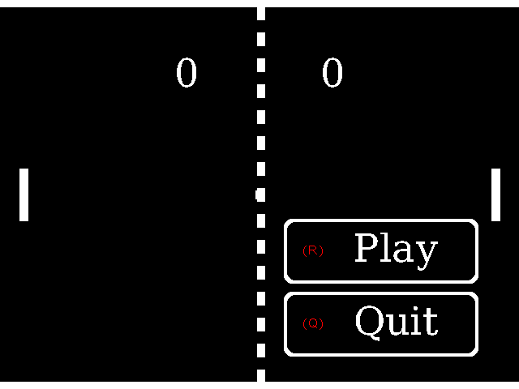

# Pong

**Pong** is an arcade game developed for the [**Mk**](https://github.com/EmbSoft3/Mk/) operating system. 
Pong is a custom recreation of the classic paddle game, with a few adjustments — the player controls 
a paddle and competes against the computer, trying to score by sending the ball past the computer-controlled paddle.

Pong is intended as a getting-started example showing how to build, install, and run an external .elf application on top of Mk.

[](Screenshots/screenshot_pong.bmp)

## Controls

| Key | Action |
|-----|--------|
| **↑** | Move right paddle up |
| **↓** | Move right paddle down |
| **R** | Start / Restart the game |
| **Q** | Quit the application |
| **CTRL+A** | Toogle auto-play mode |

## Installation

Build the application (see [Build](#build) below), then copy `pong.elf` and its
icon `mk_pong.bmp` to the Mk file system at:

```
mk/apps/pong/
```

This path corresponds to [`Mk/Storage/mk/apps/pong/`](https://github.com/EmbSoft3/Mk/tree/main/Mk/Storage/mk/apps/pong)
in the Mk repository. Once installed, Pong appears in the Mk home screen application list.

## Build

### Requirements

- [GNU Arm Embedded Toolchain 10.3-2021.10](https://developer.arm.com/downloads/-/gnu-rm) — must be added to your `PATH`
- CMake ≥ 3.25
- Ninja
- [Mk Includes](https://github.com/EmbSoft3/Mk/tree/main/Mk/Includes) — must be present at `../Mk/Mk/Includes` relative to the project root

### Build system

The project uses **CMake** with presets defined in `CMakePresets.json`:

| Preset | Type | Description |
|--------|------|-------------|
| `release-pong` | Release | Optimised build (`-Ofast`), stripped |
| `debug-pong` | Debug | Unoptimised build (`-O0 -g3`) with full debug symbols |

### Steps

1. Make sure `arm-none-eabi-gcc` is in your `PATH`:
   ```bash
   arm-none-eabi-gcc --version
   ```

2. Make sure the [Mk Includes](https://github.com/EmbSoft3/Mk/tree/main/Mk/Includes) directory
   is present at `../Mk/Mk/Includes` relative to the project root, or update `INCLUDES_API_PATH`
   in `CMakePresets.txt` accordingly.

3. Configure the project using the desired preset:
   ```bash
   cmake --preset release-shell
   ```

4. Build the firmware:
   ```bash
   cmake --build --preset release-shell
   ```

   This produces in `build/release-pong/`:
   - `pong.elf` — position-independent shared object, ready to install on the target
   - `pong.map` — linker map file

> Use the `debug-pong` preset for an unoptimised build with full debug symbols:
> ```bash
> cmake --preset debug-shell
> cmake --build --preset debug-shell
> ```

The application is compiled as a position-independent shared object (`-fPIC -shared`) and is
relocatable into any 64 KB memory page by the Mk dynamic loader.

### Compiler versions used

| Tool | Version |
|------|---------|
| `arm-none-eabi-gcc` | 10.3.1 20210824 (GNU Arm Embedded Toolchain 10.3-2021.10) |
| `arm-none-eabi-g++` | 10.3.1 20210824 (GNU Arm Embedded Toolchain 10.3-2021.10) |
| CMake | ≥ 3.25 |
| Ninja | latest |

---

## Debugging

Debugging a dynamically loaded application requires a specific GDB setup because Pong is a
position-independent shared object (`-fPIC -shared`) relocated at runtime by the Mk dynamic
loader. GDB must be told both **which symbol file to load** and **at which address it was placed
in memory**.

### Requirements

- A debug build of both **Mk** and **Pong** (see [Build](#build))
- A [J-Link](https://www.segger.com/products/debug-probes/j-link/) probe
- VSCode with the [Cortex-Debug](https://marketplace.visualstudio.com/items?itemName=marus25.cortex-debug) extension

### How the load address is determined

Pong is linked as a PIC shared object with a base address of `0x0`. At runtime, the Mk
dynamic loader allocates one or more 64 KB memory pages and copies the application image into
them. The effective load address therefore depends on which memory page the loader selected.

To find the load address of a running Pong instance, inspect the Mk allocator state in the
debugger to retrieve the base address returned to the application. This address is the value to
pass to GDB as the symbol offset.

As a reference, the example configuration uses `0xc045C000`. Adjust this value to match the
actual allocation reported by your Mk build.

### VSCode launch configuration

The following [`.vscode/launch.json`](.vscode/launch.json) configuration loads Mk symbols from
the kernel ELF (as the primary executable) and then overlays Pong symbols at the runtime
load address using `add-symbol-file`.

---

## Writing your own application

Pong is the reference example for the Mk application model. For a step-by-step guide
on how to structure your own Mk application — descriptor, entry point, event listeners,
memory layout — see the [Mk wiki](https://github.com/EmbSoft3/Mk/wiki/Writing%E2%80%90Your%E2%80%90First%E2%80%90Application).

---

## License

**Copyright (C)** 2024-2026 **RENARD Mathieu**. All rights reserved.

Mk is free software; It is distributed in the hope that it will be useful.
There is NO warranty; not even for MERCHANTABILITY or
FITNESS FOR A PARTICULAR PURPOSE.

The content of this repository is bound by the [BSD-3-Clause](LICENSE) license.
